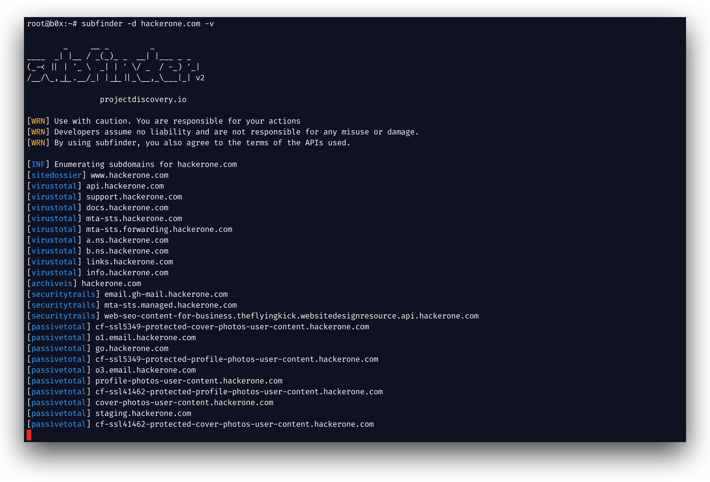

<h1 align="center">
  
  <br>
</h1>

<h4 align="center">Fast passive subdomain enumeration tool.</h4>


<p align="center">
<a href="https://goreportcard.com/report/github.com/projectdiscovery/subfinder/v2"></a>
<a href="https://github.com/projectdiscovery/subfinder/issues"></a>
<a href="https://github.com/projectdiscovery/subfinder/releases"></a>
<a href="https://twitter.com/pdiscoveryio"></a>
<a href="https://discord.gg/projectdiscovery"></a>
</p>

<p align="center">
  <a href="#features">Features</a> •
  <a href="#installation">Install</a> •
  <a href="#running-subfinder">Usage</a> •
  <a href="#post-installation-instructions">API Setup</a> •
  <a href="#subfinder-go-library">Library</a> •
  <a href="https://discord.gg/projectdiscovery">Join Discord</a>
</p>

---


`subfinder` is a subdomain discovery tool that returns valid subdomains for websites, using passive online sources. It has a simple, modular architecture and is optimized for speed. `subfinder` is built for
doing one thing only - passive subdomain enumeration, and it does that very well.

We have made it to comply with all the used passive source licenses and usage restrictions. The passive model guarantees speed and stealthiness that can be leveraged by both penetration testers and bug bounty
hunters alike.

# Features

<h1 align="left">
  </a>
  <br>
</h1>

- Fast and powerful resolution and wildcard elimination modules
- **Curated** passive sources to maximize results
- Multiple output formats supported (JSON, file, stdout)
- Optimized for speed and **lightweight** on resources
- **STDIN/OUT** support enables easy integration into workflows

# Usage

```sh
subfinder -h
```

This will display help for the tool. Here are all the switches it supports.

```yaml
Usage:
  ./subfinder [flags]

Flags:
INPUT:
  -d, -domain string[]  domains to find subdomains for
  -dL, -list string     file containing list of domains for subdomain discovery

SOURCE:
  -s, -sources string[]           specific sources to use for discovery (-s crtsh,github). Use -ls to display all available sources.
  -recursive                      use only sources that can handle subdomains recursively (e.g. subdomain.domain.tld vs domain.tld)
  -all                            use all sources for enumeration (slow)
  -es, -exclude-sources string[]  sources to exclude from enumeration (-es alienvault,zoomeyeapi)

FILTER:
  -m, -match string[]   subdomain or list of subdomain to match (file or comma separated)
  -f, -filter string[]   subdomain or list of subdomain to filter (file or comma separated)

RATE-LIMIT:
  -rl, -rate-limit int  maximum number of http requests to send per second
  -rls value            maximum number of http requests to send per second for providers in key=value format (-rls "hackertarget=10/s,shodan=15/s")
  -t int                number of concurrent goroutines for resolving (-active only) (default 10)

UPDATE:
  -up, -update                 update subfinder to latest version
  -duc, -disable-update-check  disable automatic subfinder update check

OUTPUT:
  -o, -output string       file to write output to
  -oJ, -json               write output in JSONL(ines) format
  -oD, -output-dir string  directory to write output (-dL only)
  -cs, -collect-sources    include all sources in the output (-json only)
  -oI, -ip                 include host IP in output (-active only)

CONFIGURATION:
  -config string                flag config file (default "$CONFIG/subfinder/config.yaml")
  -pc, -provider-config string  provider config file (default "$CONFIG/subfinder/provider-config.yaml")
  -r string[]                   comma separated list of resolvers to use
  -rL, -rlist string            file containing list of resolvers to use
  -nW, -active                  display active subdomains only
  -proxy string                 http proxy to use with subfinder
  -ei, -exclude-ip              exclude IPs from the list of domains

DEBUG:
  -silent             show only subdomains in output
  -version            show version of subfinder
  -v                  show verbose output
  -nc, -no-color      disable color in output
  -ls, -list-sources  list all available sources

OPTIMIZATION:
  -timeout int   seconds to wait before timing out (default 30)
  -max-time int  minutes to wait for enumeration results (default 10)
```

## Environment Variables

Subfinder supports environment variables to specify custom paths for configuration files:

- `SUBFINDER_CONFIG` - Path to config.yaml file (overrides default `$CONFIG/subfinder/config.yaml`)
- `SUBFINDER_PROVIDER_CONFIG` - Path to provider-config.yaml file (overrides default `$CONFIG/subfinder/provider-config.yaml`)

# Installation

`subfinder` requires **go1.24** to install successfully. Run the following command to install the latest version:

```sh
go install -v github.com/projectdiscovery/subfinder/v2/cmd/subfinder@latest
```

Learn about more ways to install subfinder here: https://docs.projectdiscovery.io/tools/subfinder/install.

## Post Installation Instructions

`subfinder` can be used right after the installation, however many sources required API keys to work. Learn more here: https://docs.projectdiscovery.io/tools/subfinder/install#post-install-configuration.

## Running Subfinder

Learn about how to run Subfinder here: https://docs.projectdiscovery.io/tools/subfinder/running.

## Subfinder Go library

Subfinder can also be used as library and a minimal examples of using subfinder SDK is available [here](examples/main.go)

</td>
</tr>
</table>

### Resources

- [Recon with Me !!!](https://dhiyaneshgeek.github.io/bug/bounty/2020/02/06/recon-with-me/)

# License

`subfinder` is made with 🖤 by the [projectdiscovery](https://projectdiscovery.io) team. Community contributions have made the project what it is. See
the **[THANKS.md](https://github.com/projectdiscovery/subfinder/blob/main/THANKS.md)** file for more details.

Read the usage disclaimer at [DISCLAIMER.md](https://github.com/projectdiscovery/subfinder/blob/main/DISCLAIMER.md) and [contact us](mailto:contact@projectdiscovery.io) for any API removal.
